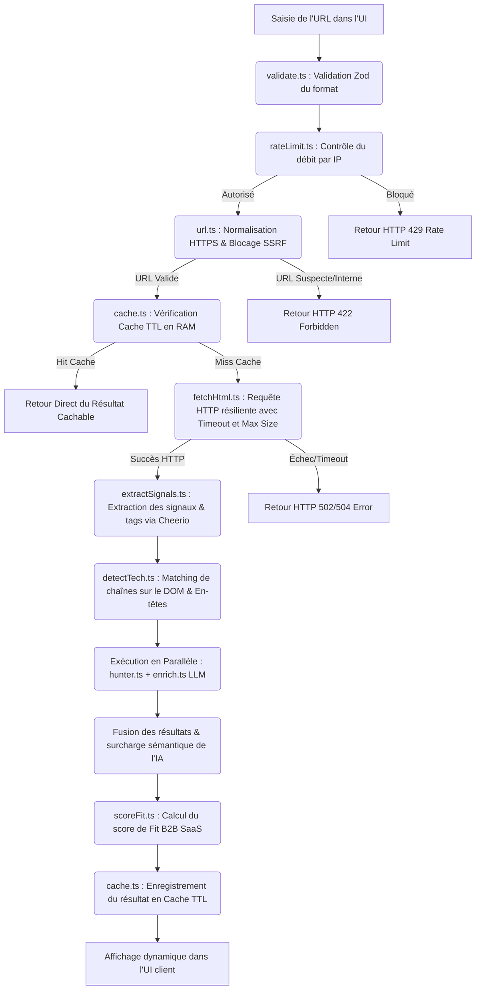

# 💼 Youno — Website Intelligence Analyzer (Konsole MVP)

> Un module d'enrichissement et d'intelligence Web conçu pour la plateforme SaaS **Konsole** de Youno. Ce service analyse n'importe quel site web pour en extraire l'identité de l'entreprise, sa tech stack, ses signaux Go-To-Market (GTM), des contacts qualifiés, et calcule un score de pertinence B2B SaaS.

---

## 🌐 Démo en Ligne

L'application est déployée et accessible publiquement :

* **Lien de production :** [https://youno.netlify.app](https://youno.netlify.app) *(ou sur le service de déploiement configuré)*
* **Code Source :** [https://github.com/Mohamedsellak/youno](https://github.com/Mohamedsellak/youno)

---

## ✨ Fonctionnalités Clés

1. **Scraping et Analyse Structurée (Cheerio) :** Extraction instantanée des métadonnées HTML (titre, description meta, tags OpenGraph), des structures de liens et du contenu textuel visible.
2. **Détection Automatique de la Tech Stack :** Identification performante et légère des frameworks, CMS, outils d'analytique, CRMs et plateformes de paiement via des empreintes HTML et d'en-têtes HTTP.
3. **Identification des Signaux GTM :** Détection d'intentions commerciales (page Tarifs, appel à l'action Démo/Contact, page Recrutement, présence d'un Blog, liens vers les réseaux sociaux professionnels, outils de tracking).
4. **Enrichissement Email & Contacts (Hunter.io) :** Récupération de contacts professionnels clés et de schémas d'adresses email associés au domaine.
5. **Enrichissement Sémantique par IA (Cascade OpenRouter) :** Qualification avancée de l'entreprise (nom, description synthétique, secteur d'activité, taille estimée de l'effectif) via des modèles d'IA gratuits, avec système de fallback résilient.
6. **Scoring Prédictif B2B SaaS :** Algorithme transparent et déterministe évaluant l'adéquation commerciale de la cible avec un profil B2B SaaS.

---

## 🏛️ Architecture & Flux de Données

Lorsqu'un utilisateur soumet une URL (ex: `stripe.com`) dans l'interface, le flux d'exécution traverse les couches suivantes de manière séquentielle et optimisée :



### 1. Orchestration du Pipeline (`app/api/analyze/route.ts`)

* **Exécution Concurrente :** Nous utilisons `Promise.all` pour appeler simultanément l'API de Hunter.io et le modèle LLM d'OpenRouter, minimisant ainsi le temps d'attente total à la latence de la requête la plus lente.
* **Dégradation Gracieuse (Graceful Degradation) :** L'application ne plante jamais si un service externe échoue. Si la limite mensuelle de Hunter est atteinte ou si les APIs LLM subissent une surcharge générale, le pipeline intercepte l'erreur, bascule sur une confiance basse et retourne les données brutes extraites du site (tech stack, signaux GTM locaux), garantissant un service fonctionnel 100 % du temps.

---

## ⚙️ Choix Techniques & Justifications

Notre architecture privilégie l'efficacité, la rapidité d'exécution et le minimalisme technologique :

| Outil / Framework | Rôle & Composant | Justification & Avantages |
| :--- | :--- | :--- |
| **Next.js 16 (App Router)** | Framework Global | Idéal pour déployer des routes d'API Serverless performantes, bénéficier du rendu côté serveur, et s'intégrer nativement sur Netlify. |
| **Cheerio** | Scraper DOM HTML | Extraction ultra-rapide en mémoire sans la lourdeur d'un navigateur sans tête (Headless Browser comme Puppeteer ou Playwright). Consommation de RAM minime et latence réseau optimisée. |
| **OpenRouter API** | Enrichissement LLM | Permet de requêter des modèles open-source performants et gratuits (Gemma, Llama, DeepSeek) avec une seule clé d'API unifiée. |
| **Hunter.io API** | Recherche de Contacts | Standard de l'industrie pour extraire des adresses emails professionnelles qualifiées et des profils associés à partir d'un domaine. |
| **Tailwind CSS v4 & shadcn/ui** | Design & UI | Utilisation de jetons de design CSS natifs, animations fluides, mode sombre par défaut et mise en page responsive de type Dashboard Bento-Grid haut de gamme. |
| **Zod** | Validation de Schéma | Sécurisation et typage des entrées de l'API à la frontière client-serveur. |

---

## 🚀 Lancement en Local

### Prérequis

* Node.js version 18 ou supérieure
* Un gestionnaire de paquets (npm, yarn ou pnpm)

### Étapes d'Installation

1. **Cloner le dépôt GitHub :**

   ```bash
   git clone https://github.com/Mohamedsellak/youno.git
   cd youno
   ```

2. **Installer les dépendances :**

   ```bash
   npm install
   ```

3. **Configurer les variables d'environnement :**
   Dupliquez le fichier d'exemple et renseignez vos clés de services :

   ```bash
   cp .env.example .env
   ```

   Éditez ensuite le fichier `.env` :
   * `OPENROUTER_API_KEY` : Votre clé API [OpenRouter](https://openrouter.ai/keys) *(Obligatoire pour l'IA)*
   * `HUNTER_API_KEY` : Votre clé API [Hunter.io](https://hunter.io/api-keys) *(Optionnel, l'app fonctionne sans)*

4. **Lancer le serveur de développement :**

   ```bash
   npm run dev
   ```

5. **Accéder à l'application :**
   Ouvrez votre navigateur sur [http://localhost:3000](http://localhost:3000).

---

## 🔒 Sécurité & Résilience

Le scraper de Konsole intègre des mécanismes rigoureux pour se protéger contre les abus et les attaques d'infrastructure :

* **Protection contre le SSRF (Server-Side Request Forgery) :** Notre module `lib/url.ts` normalise l'URL saisie et bloque impérativement les requêtes vers des hôtes locaux (`localhost`, `127.0.0.1`, `[::1]`), les sous-réseaux IP privés (ex: `192.168.x.x`, `10.x.x.x`), les métadonnées de cloud (`169.254.169.254`, `metadata.google.internal`), et les domaines d'infrastructure locale (`*.local`).
* **Limitation des Requêtes HTTP (Timeout & Size Limits) :** Afin d'éviter qu'une URL malveillante ou un flux infini ne bloque le serveur, la requête d'extraction HTML (`lib/fetchHtml.ts`) est contrainte à un **timeout strict de 10 secondes** et le téléchargement du DOM est coupé à un **maximum de 10 Mo**.
* **Rate Limiting Sans Base de Données :** Un système de fenêtre glissante (`lib/rateLimit.ts`) stocke temporairement les horodatages des requêtes par IP en mémoire RAM. Par défaut, il bloque les clients dépassant **10 requêtes par 10 minutes** pour éviter le déni de service.
* **Cache TTL Local :** Pour économiser les crédits d'API et accélérer les requêtes redondantes, un cache local en mémoire (`lib/cache.ts`) conserve les analyses pour une durée de **5 minutes**.

---

## 📊 Système de Scoring (Logique B2B SaaS Fit)

Le scoring évalue si l'entreprise détectée représente une cible commerciale pertinente pour un produit vendu à des entreprises SaaS B2B. La logique s'appuie sur un système de points transparent et déterministe (`lib/score.ts`) :

> [!NOTE]
> Le score de fit commence à une **base neutre de 5 / 10** et applique les règles suivantes :

* **Indicateurs SaaS Forts :**
  * **Page de tarifs / plans (+2) :** Présence d'un lien contenant `/pricing` ou `/plans` (indique un modèle de souscription récurrent).
  * **CTA de démo ou contact (+2) :** Liens de type `/demo`, `/book-demo` ou `/contact-sales` (indique une démarche Go-To-Market structurée).
* **Signaux d'Activité / Marketing :**
  * **Page Recrutement (+1) :** Liens `/careers` ou `/jobs` (croissance d'effectifs).
  * **Blog actif (+1) :** Liens `/blog` ou `/articles` (stratégie d'inbound marketing).
  * **Outils B2B Détectés (+1) :** Utilisation active d'outils analytiques/marketing d'entreprise (Segment, HubSpot ou Intercom).
* **Pénalités de Hors-Cible :**
  * **Détection E-commerce (-2) :** Utilisation de Shopify (indique une boutique en ligne B2C/B2B et non un éditeur de logiciel).
  * **CMS Traditionnel (-1) :** Utilisation de WordPress (indique souvent un site vitrine classique de PME locale).

**Catégorisation finale :**

* `0 à 3` : **Low Fit** (Faible adéquation)
* `4 à 7` : **Medium Fit** (Adéquation moyenne)
* `8 à 10` : **High Fit** (Forte adéquation SaaS)

---

## ⚠️ Limites Actuelles & Solutions Futures

Pour passer à l'échelle en production avec **Konsole**, voici les limites identifiées et leurs solutions :

1. **Cache en RAM Volatile (Serveurs Multiples & Serverless)**  
   * **Problème :** Le cache et rate limiter actuels (Map) sont isolés dans la RAM d'un seul serveur. Ils sont perdus à chaque redémarrage et inutiles derrière un Load Balancer.
   * **Solution :** Migrer vers **Redis (ex: Upstash)** pour partager un état persistant et distribué entre tous les serveurs ou instances cloud.

2. **Limites de l'IA (Rate Limits & Timeouts)**  
   * **Problème :** Les modèles LLM gratuits sont sujets aux saturations et timeouts réseaux fréquents.
   * **Solution :** Utiliser notre **système de Cascade LLM avec des timeouts courts (8s)**, et idéalement basculer le traitement lourd sur des **Files d'attente (Queues via BullMQ)**.

3. **Sites Protégés (Pare-feu & Captcha)**  
   * **Problème :** Cloudflare et les WAF bloquent fréquemment les requêtes provenant d'IP de serveurs (Vercel, AWS).
   * **Solution :** Intégrer des **Proxies rotatifs résidentiels** ou des services de scraping dédiés capables de résoudre silencieusement les captchas.

4. **Applications Single-Page (SPA sans SSR)**  
   * **Problème :** Cheerio est aveugle aux sites entièrement rendus côté client (ex: pure React/Vue), car le HTML initial est vide.
   * **Solution :** Déclencher un fallback automatique vers un **Navigateur Headless (Playwright)** lorsque l'extraction Cheerio initiale ne retourne pas de texte pertinent.
